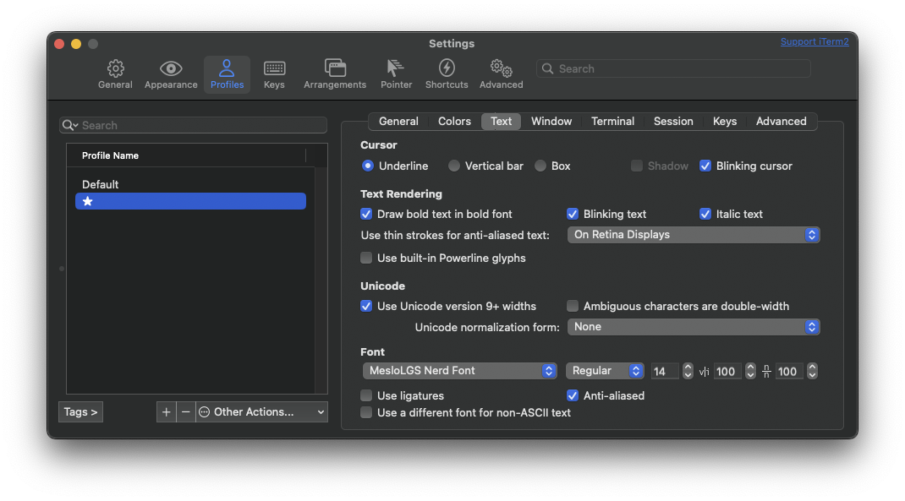

# My dotfiles repo

I use [Homesick](https://github.com/technicalpickles/homesick) to manage my dotfiles.

## (Mostly) Auto bootstrap of a new mac

Change the `COMPUTER_NAME` environment variable to be whatever you want. Or leave it out to not change the default computer name.

```
curl -O https://raw.githubusercontent.com/natemccurdy/dotfiles/master/bootstrap_new_mac.sh && chmod u+x bootstrap_new_mac.sh
COMPUTER_NAME=foo ./bootstrap_new_mac.sh
```

## Manual Installation

### ZSH

1. oh-my-zsh: `sh -c "$(curl -fsSL https://raw.githubusercontent.com/robbyrussell/oh-my-zsh/master/tools/install.sh)"`
1. `mkdir ~/src`

I use the [PowerLevel9k](https://github.com/bhilburn/powerlevel9k.git) ZSH theme

1. `git clone https://github.com/bhilburn/powerlevel9k.git ~/src/powerlevel9k`

### Homesick

1. Install Homesick with `gem install homesick`
1. Clone this castle with `homesick clone natemccurdy/dotfiles`
1. Create the symlinks with `homesick symlink dotfiles`

### Homebrew

I use [Homebrew Bundle](https://github.com/Homebrew/homebrew-bundle) for most of my application installations

1. Install HomeBrew: `/usr/bin/ruby -e "$(curl -fsSL https://raw.githubusercontent.com/Homebrew/install/master/install)"`
1. Install all the brews: `homesick cd && brew bundle`

### Gems

1. `gem install r10k puppet-lint rubocop`

### Vim plugins

1. [Vim-Plug](https://github.com/junegunn/vim-plug) Install: `curl -fLo ~/.vim/autoload/plug.vim --create-dirs https://raw.githubusercontent.com/junegunn/vim-plug/master/plug.vim`
1. Install Vim plugins: `vim +PlugInstall +qall`

### Colors and Fonts

GruvBox iTerm2 color scheme. Download it, open it, then set it as your profile's color scheme: <https://github.com/morhetz/gruvbox-contrib/raw/master/iterm2/gruvbox-dark.itermcolors>


I use the Awesome patched fonts.

1. Download and and doubleclick to import or move it to `~/Library/Fonts/`
    * <https://github.com/gabrielelana/awesome-terminal-fonts/raw/patching-strategy/patched/Inconsolata%2BAwesome.ttf>
1. Configure your profile in iTerm2 to use that font for **Non ASCII Font**:



### MacOS Settings and Tweaks

```
homesick cd && COMPUTER_NAME=foo ./home/.bin/osx.sh
```

## Other Mac Applications

Here are some apps from the Apple Store that I use all the time. They're on Homebrew, but I use the App Store versions so that my registration info is automatically setup.

* Amphetamine: <https://itunes.apple.com/us/app/amphetamine/id937984704?mt=12>
* Gifox: <https://gifox.io/>
* Moom: <https://manytricks.com/moom/>
* Witch: <https://manytricks.com/witch/>

These installs can be automated with [MAS](https://github.com/mas-cli/mas):

```
brew install mas
mas install 937984704    # Amphetamine
mas install 1082624744   # Gifox
mas install 419330170    # Moom
mas install 412485838    # Witch
```

