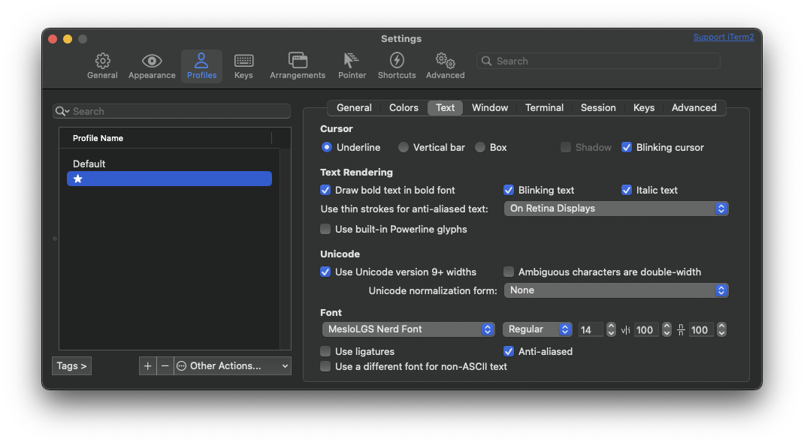

# My dotfiles repo

I use [chezmoi](https://www.chezmoi.io/) to manage my dotfiles. It's a single Go binary with no runtime dependencies.

## Bootstrap a new Mac

Downloads and runs the bootstrap script, which installs Homebrew, chezmoi, oh-my-zsh, and applies all dotfiles:

```bash
curl -O https://raw.githubusercontent.com/natemccurdy/dotfiles/main/bootstrap_new_mac.sh \
  && chmod u+x bootstrap_new_mac.sh
COMPUTER_NAME=foo ./bootstrap_new_mac.sh
```

## Manual Installation

### chezmoi

Install chezmoi and apply dotfiles in one shot:

```bash
sh -c "$(curl -fsLS get.chezmoi.io)" -- init --apply github.com/natemccurdy/dotfiles
```

This clones the repo to `~/.local/share/chezmoi` and applies all dotfiles.

If you already have the repo cloned elsewhere (e.g. `~/src/dotfiles`), point chezmoi at it:

```bash
mkdir -p ~/.config/chezmoi
echo 'sourceDir = "~/src/dotfiles"' > ~/.config/chezmoi/chezmoi.toml
chezmoi apply
```

### ZSH

1. oh-my-zsh: `sh -c "$(curl -fsSL https://raw.githubusercontent.com/ohmyzsh/ohmyzsh/master/tools/install.sh)"`
1. `mkdir ~/src`

I use the [PowerLevel10k](https://github.com/romkatv/powerlevel10k.git) ZSH theme:

```bash
git clone --depth 1 https://github.com/romkatv/powerlevel10k.git \
  ${ZSH_CUSTOM:-$HOME/.oh-my-zsh/custom}/themes/powerlevel10k
```

### Homebrew

I use [Homebrew Bundle](https://github.com/Homebrew/homebrew-bundle) for most app installations:

```bash
brew bundle --file=~/.local/share/chezmoi/Brewfile
```

### NeoVim plugins

1. Open `nvim`
1. lazy.nvim will install all plugins, Mason will install tools.

### Colors and Fonts

GruvBox iTerm2 color scheme:

```bash
wget https://github.com/morhetz/gruvbox-contrib/raw/master/iterm2/gruvbox-dark.itermcolors
open gruvbox-dark.itermcolors
rm gruvbox-dark.itermcolors
```

MesloLGS Nerd Font:

```bash
brew install --cask font-meslo-lg-nerd-font
```



### MacOS Settings and Tweaks

```bash
COMPUTER_NAME=foo ~/.bin/osx.sh
```

## Other Mac Applications

Apps from the Apple Store I use regularly (App Store versions handle registration automatically):

* Amphetamine: `brew install mas && mas install 937984704`
* Gifox: <https://gifox.io/>
* Moom: <https://manytricks.com/moom/>
* Witch: <https://manytricks.com/witch/>

## Day-to-day chezmoi usage

### Edit a dotfile

```bash
chezmoi edit ~/.gitconfig          # opens the source file in $EDITOR
# or cd into the source dir and edit directly:
chezmoi cd
vim home/dot_gitconfig.tmpl
```

### See what would change before applying

```bash
chezmoi diff                       # diff between source and home dir
chezmoi status                     # short summary of changed files
```

### Apply changes to your home dir

```bash
chezmoi apply                      # apply all pending changes
chezmoi apply ~/.gitconfig         # apply a single file
```

### Commit and push dotfile changes

```bash
chezmoi cd
git add -p
git commit -m "description of change"
git push
```

### Pull and apply updates on another machine

```bash
chezmoi update                     # git pull + apply in one shot
```

### Add a new dotfile to chezmoi management

```bash
chezmoi add ~/.foo                 # copies ~/.foo into the source dir
chezmoi add --template ~/.foo      # same, but marks it as a template (for machine-specific values)
```

### Re-sync if you edited a file in ~ directly

```bash
chezmoi merge ~/.gitconfig         # 3-way merge: source vs disk vs last-known
chezmoi add ~/.gitconfig           # or: overwrite source with what's on disk
```
